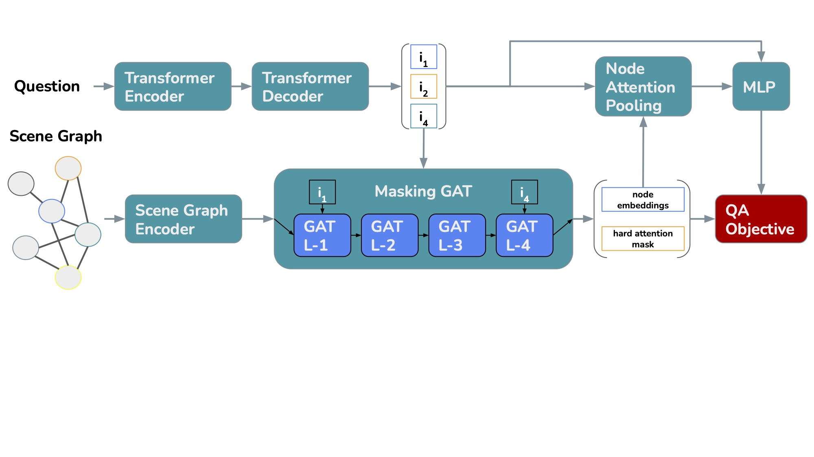

# Intrinsic Subgraph Generation for Interpretable Graph based Visual Question Answering

Eval scripts coming soon.

## Paper Links
[](https://arxiv.org/abs/2403.17647)
[](https://aclanthology.org/2024.lrec-main.806)

## Approach


## Installation
### Python Environment
Create a virtual python environment with e.g. conda:
```bash
conda create --name isubgvqa python=3.11
```
Activate the environment
```bash
conda activate isubgvqa
```
### PyTorch
Please [install PyTorch](https://pytorch.org/get-started/locally/)
```bash
pip install torch torchvision torchaudio
```

### PyG (PyTorch-Geometric)
Please [install PyG](https://pytorch-geometric.readthedocs.io/en/latest/install/installation.html) 
```bash
pip install torch_geometric
```
Install optional packages:
```bash
pip install pyg_lib torch_scatter torch_sparse torch_cluster torch_spline_conv -f https://data.pyg.org/whl/torch-2.2.0+cu121.html
```

### Spacy
Install spacy and download en_core_web_sm
```bash
pip install -U pip setuptools wheel
pip install -U spacy
python -m spacy download en_core_web_sm
```

## Citation
```bibtex
@inproceedings{tilli-vu-2024-intrinsic-subgraph,
    title = "Intrinsic Subgraph Generation for Interpretable Graph Based Visual Question Answering",
    author = "Tilli, Pascal  and
      Vu, Ngoc Thang",
    booktitle = "Proceedings of the 2024 Joint International Conference on Computational Linguistics, Language Resources and Evaluation (LREC-COLING 2024)",
    month = may,
    year = "2024",
    address = "Torino, Italy",
    publisher = "ELRA and ICCL",
    url = "https://aclanthology.org/2024.lrec-main.806",
    pages = "9204--9223",
}
```
